<div align="center">

# One Work

**又快 · 又安全 · 还省钱**

### Agent Cowork 平台 — 一个人用是创作引擎，一个团队用是交付平台

<br>

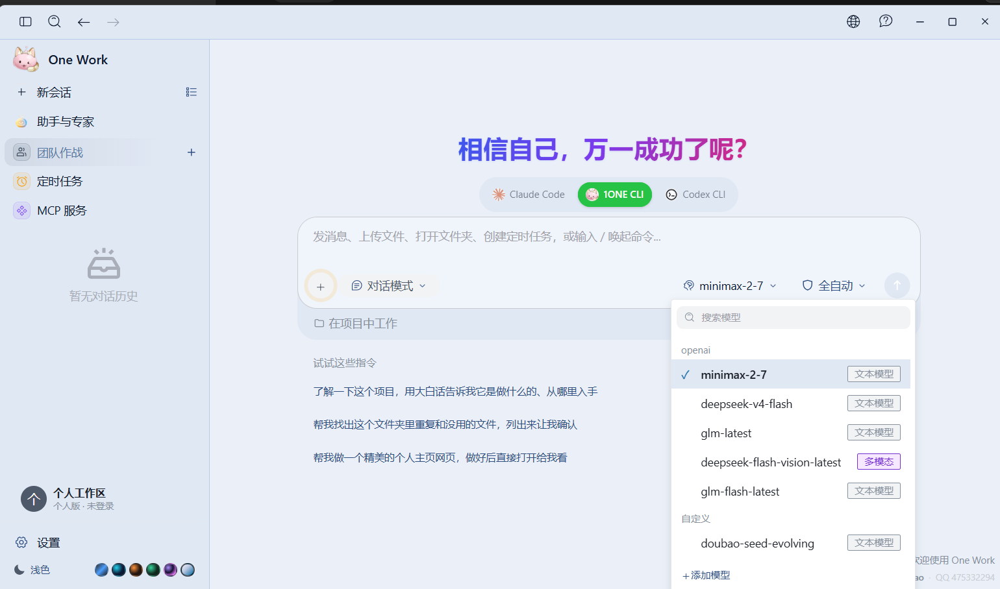

<br>

**少见地让 Codex CLI / Claude Code 官方客户端，直接换成你自己的模型。**

38 款 CLI Agent 统一指挥 · Team Mode 编队并行 · 274 助手与专家开箱即用 · 对话与 Key 默认落本机

<br>

<a href="https://github.com/gaogg521/dream-ui/releases"></a>
&nbsp;
<a href="https://work.1oneclaw.com/"></a>
&nbsp;
<a href="https://work.1oneclaw.com/docs.html"></a>

<br><br>

| **38+** CLI Agent | **274** 助手与专家 | **Apache-2.0** 开源 | **v3.0** 开箱即用 |
| :---: | :---: | :---: | :---: |
| 本机自动识别 | 22 官方 + 252 专家 | 可私有化部署 | 免费模型一键开聊 |


</div>

---

> **Cursor** 帮你写下一行代码 · **Copilot** 补全一个函数 · **One Work** 帮你**统管一整支 AI 队伍**，并把产出写进团队交付流程

---

## 五大优势

> 速度快 · 隐私安全 · 省钱 · **官方 CLI 一键桥接** · 本地化部署 —— 这五件事，决定了 One Work 不是「又一个聊天窗口」。

<br>

<table>
<tr>
<td width="120" align="center"><h2>01</h2><strong>速度快</strong><br><br><code>5×</code><br><sub>较某 Buddy</sub></td>
<td>

### 输出更快，交付不等

Team Mode 多 Agent **并行执行**：Leader 拆任务、Teammate 同时跑。同样交付约为某 Buddy 的 **5 倍**、某 Work 的 **3 倍**。

`Team Mode 并行` · `多成员同时执行` · `作战记录可导出`

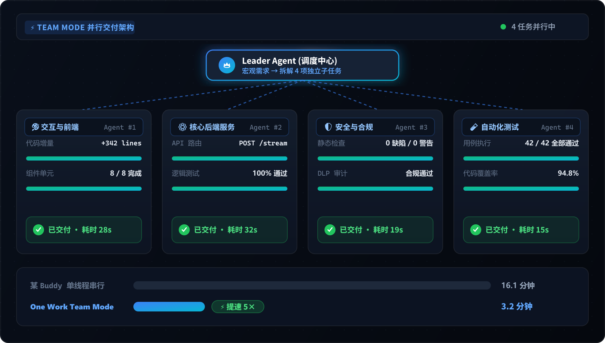

</td>
</tr>
</table>

<br>

<table>
<tr>
<td width="120" align="center"><h2>02</h2><strong>隐私安全</strong></td>
<td>

### 数据与 Key 落本机

记忆、项目路径、API Key 与 `CLAUDE.md` **全部保存在本机目录**。远程 IM / WebUI 只是发指令，Agent 仍在你电脑上执行，**不经我们服务器中转**。

`记忆本地存储` · `Key 不外传` · `操作可批准可审计`

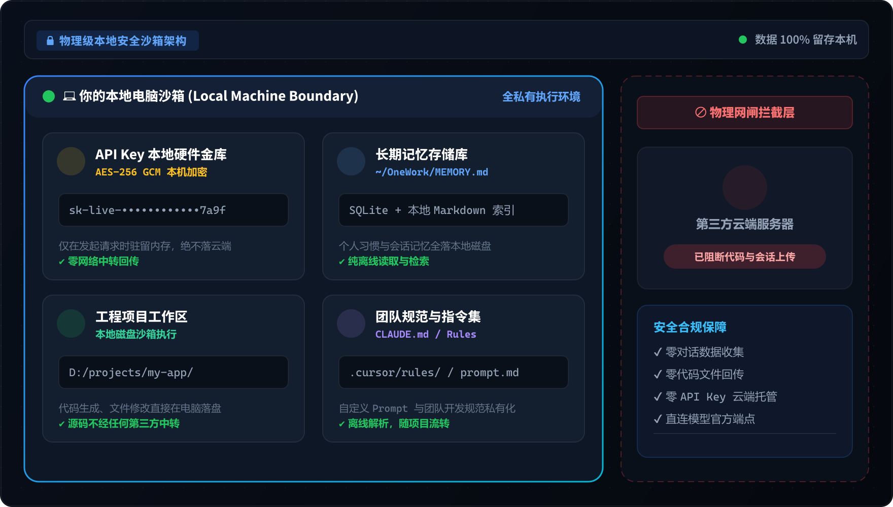

</td>
</tr>
</table>

<br>

<table>
<tr>
<td width="120" align="center"><h2>03</h2><strong>省钱</strong><br><br><code>−35%</code><br><sub>Token</sub></td>
<td>

### Token 消耗更低

**252 个编译期内置专家** + Skill 复用，减少重复 Prompt。同任务 Token 比某 Buddy 低约 **35%**、比某 Work 低约 **22%**。

`252 内置专家` · `Skill 复用` · `任意模型 API`

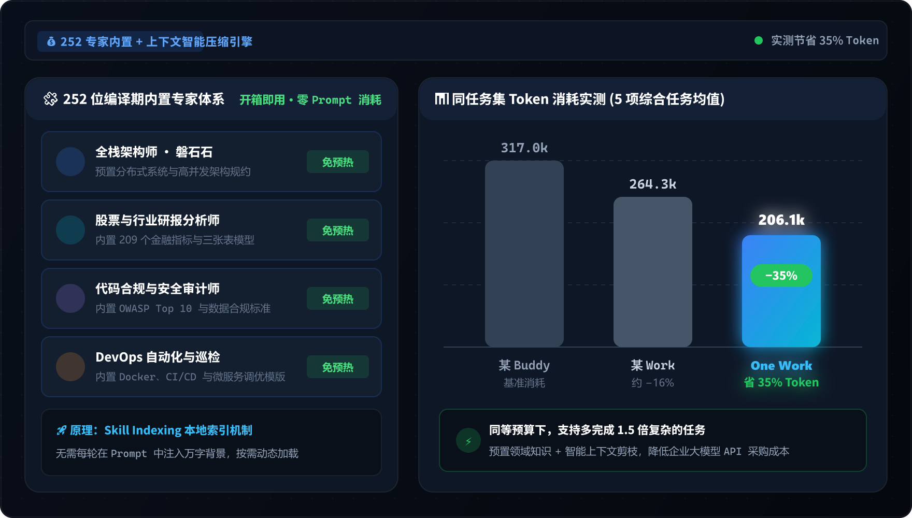

</td>
</tr>
</table>

<br>

<table>
<tr>
<td width="120" align="center"><h2>04</h2><strong>独家</strong><br><br>🔥<br><sub>桥接</sub></td>
<td>

### Codex / Claude 一键桥接 —— 我们最大的差异化

OpenAI **Codex CLI** 和 Anthropic **Claude Code** 被厂商锁死在官方账号。One Work 在本机起一个兼容端点，**官方 CLI 直接走你自配的 MiniMax、DeepSeek、Kimi 或自建网关** —— 纯本地转发，关闭即恢复。

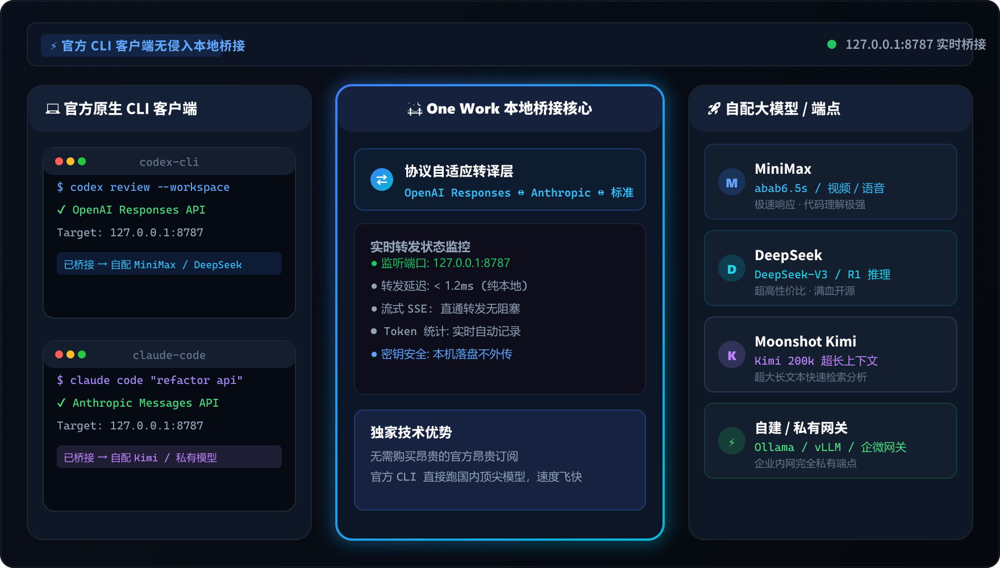

</td>
</tr>
</table>

<br>

<table>
<tr>
<td width="120" align="center"><h2>05</h2><strong>本地化</strong></td>
<td>

### 企业内网 · 可私有化

WebUI 局域网 / 内网部署，配合 Issues 审计、数字员工与**离线授权** —— 数据不出边界。后端可 Docker 独立部署，桌面与 WebUI 以客户端模式连过去。

`WebUI 内网` · `Issues 审计` · `离线授权 ONEWORK-…`

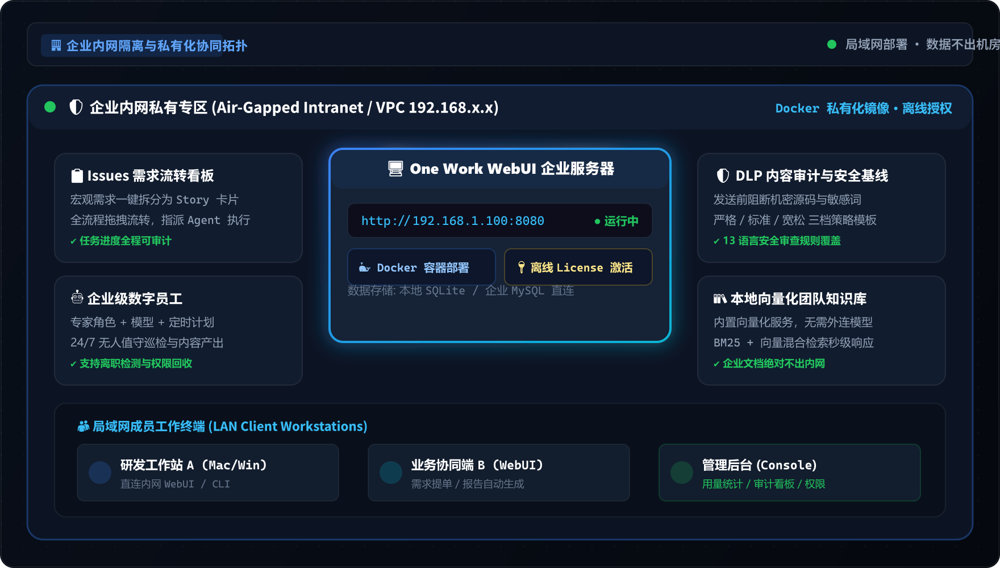

</td>
</tr>
</table>

---

## v3.0 · 装好就能聊

首次启动 **一键启用内置免费模型**，无需先填 API Key。22 位官方助手 + 252 位行业专家编译期内置，断网也有完整目录。

<p align="center">
  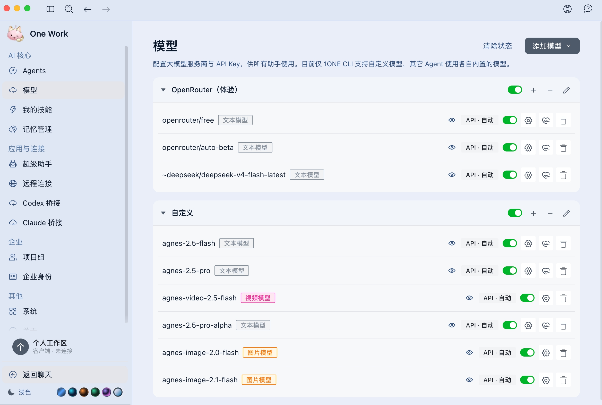
</p>

---

## 还能做什么

<details open>
<summary><strong>🤝 Team Mode · 四步组队</strong></summary>
<br>
<table>
<tr>
<td width="25%">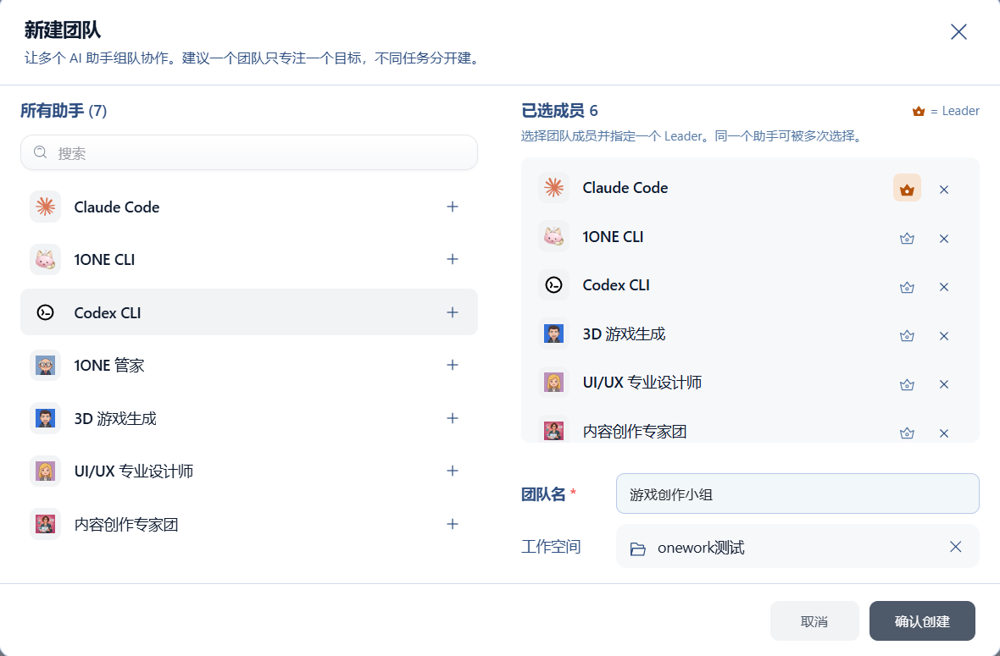<br><sub>① 发起编队</sub></td>
<td width="25%">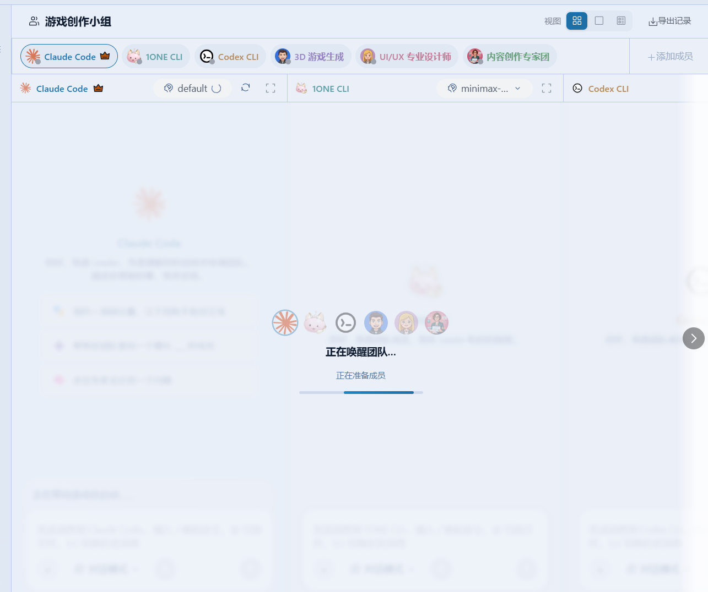<br><sub>② 选成员</sub></td>
<td width="25%">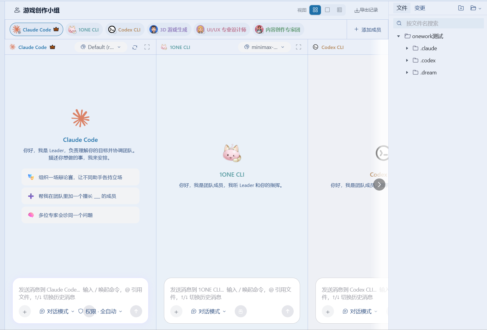<br><sub>③ 指定 Leader</sub></td>
<td width="25%">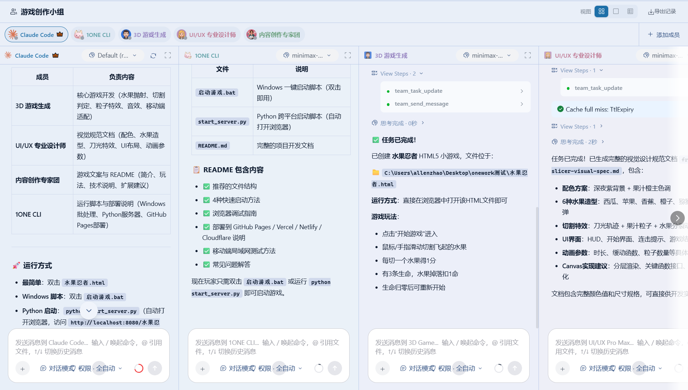<br><sub>④ 并行交付</sub></td>
</tr>
</table>
作战记录可一键导出离线 HTML，工具调用全量保留。
</details>

<details>
<summary><strong>📋 Issues 看板 · 产出写进交付流程</strong></summary>
<br>
<p align="center">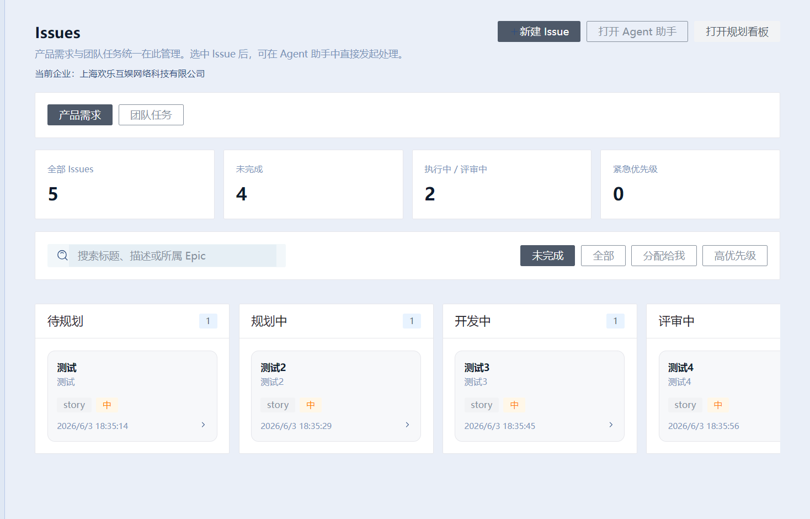</p>
AI 一键拆单，任务直接交给 Agent，进度团队可见。
</details>

<details>
<summary><strong>🎨 AI 出图出片 · 花费实时可见</strong></summary>
<br>
<table>
<tr>
<td width="33%"><br><sub>文生图</sub></td>
<td width="33%"><br><sub>文生视频</sub></td>
<td width="33%"><br><sub>内容创作</sub></td>
</tr>
</table>
</details>

<details>
<summary><strong>📱 离开工位 · 不丢控制权</strong></summary>
<br>
<table>
<tr>
<td width="50%">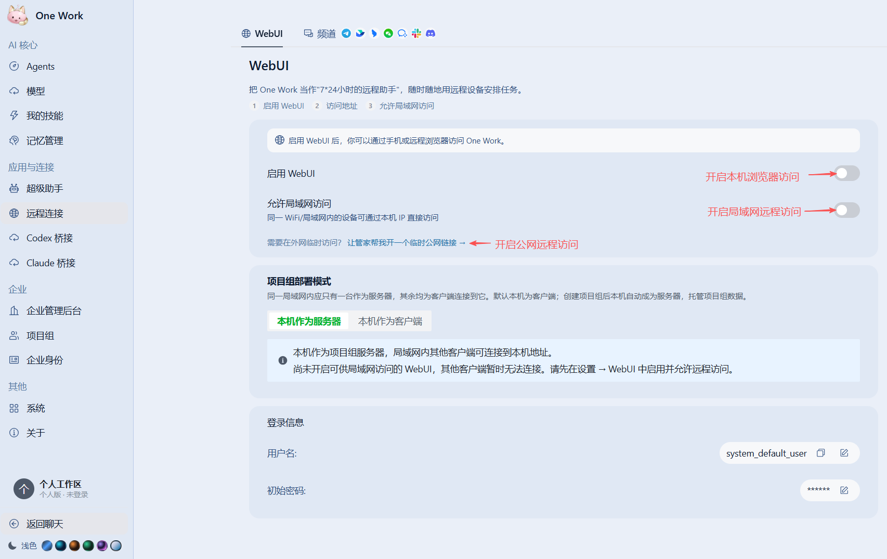<br><sub>WebUI 远程 · 手机扫码</sub></td>
<td width="50%"><br><sub>飞书 / 钉钉 / 微信 / Telegram</sub></td>
</tr>
</table>
</details>

<details>
<summary><strong>🎮 一句话做游戏 · 38 款 Agent 统一指挥</strong></summary>
<br>
<table>
<tr>
<td width="50%">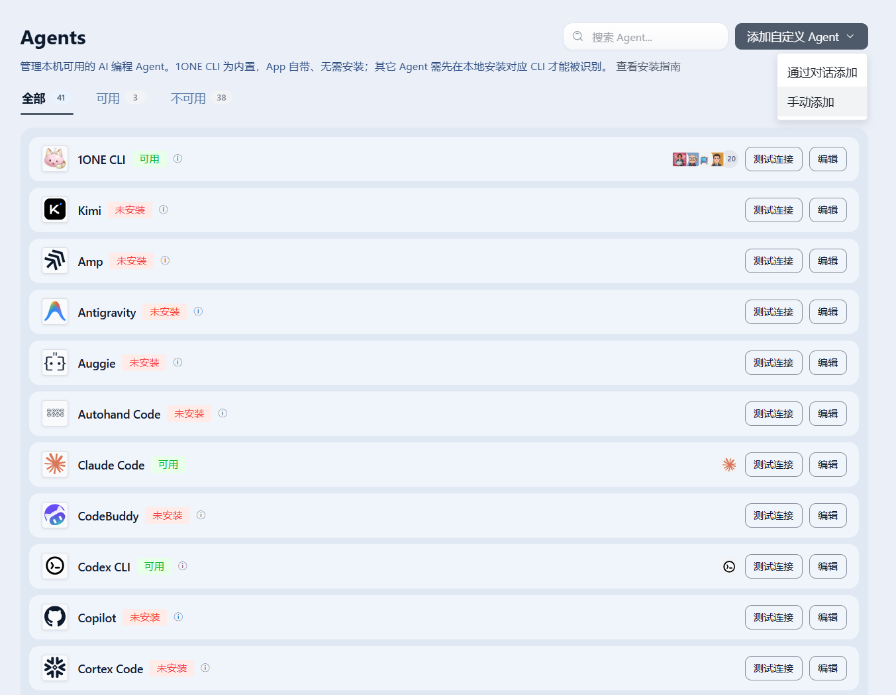<br><sub>38 款 CLI 自动识别</sub></td>
<td width="50%">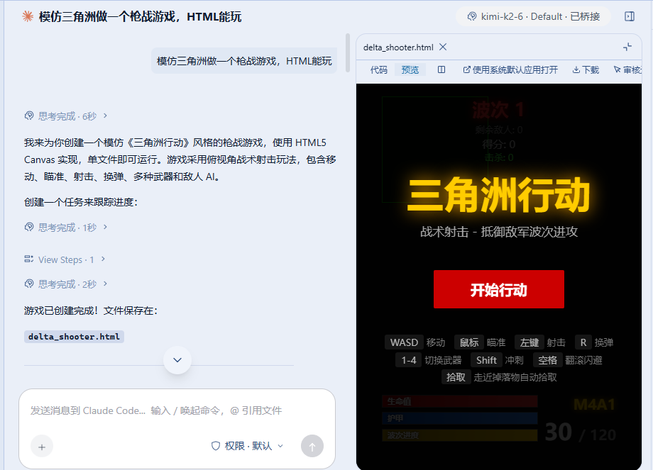<br><sub>一句话生成可玩 Demo</sub></td>
</tr>
</table>
</details>

---

## 和 Cursor / Copilot 比什么

| | **One Work** | Cursor | Copilot | Claude Code |
| --- | :---: | :---: | :---: | :---: |
| 开源 | ✅ | 🔒 | 🔒 | 🔒 |
| **Codex/Claude 桥接自配模型** | ✅ **独家** | ❌ | ❌ | ❌ |
| 38 款 Agent + Team 编队 | ✅ | ⚠️ | ⚠️ | ❌ |
| 274 助手与专家内置 | ✅ | ❌ | ❌ | ⚠️ |
| WebUI + IM 远程指挥 | ✅ | ❌ | ❌ | ❌ |
| 数据默认落本机 | ✅ | ⚠️ | ⚠️ | ⚠️ |
| 企业 Issues / 私有化 | ✅ | ❌ | ❌ | ⚠️ |

👉 [完整对比 · 阿里/腾讯/字节 Agent](https://work.1oneclaw.com/docs-faq.html)

---

## 3 分钟上手

1. [下载 v3.0](https://github.com/gaogg521/dream-ui/releases)（Windows `.exe` / macOS `.dmg` / Linux `.deb`）
2. 首次启动 → **一键启用免费模型** 或配置自己的 API Key
3. 选 **1ONE CLI** 或本机 Claude Code / Codex → 开聊
4. 需要桥接 → **设置 → Codex 桥接 / Claude 桥接**
5. 需要远程 → **设置 → WebUI** 或接入 IM 渠道

<details>
<summary>🍎 macOS Gatekeeper 被拦截？</summary>

```bash
xattr -cr "/Applications/One Work.app"
```

或 **系统设置 → 隐私与安全性 → 仍要打开**。
</details>

---

<details>
<summary><strong>🔧 开发者 · 本仓库 dream-ui</strong></summary>

<br>

One Work 桌面客户端 / WebUI 前端。后端：[dream-core](https://github.com/gaogg521/dream-core)（Rust `dreamcore`）。

```powershell
git clone https://github.com/gaogg521/dream-ui.git
git clone https://github.com/gaogg521/dream-core.git
cd dream-ui && bun install && bun run dev
```

| 文档 | 说明 |
| --- | --- |
| [开发者上手指南](./docs/guides/fork-dev-onboarding.zh-CN.md) | 克隆、dev、打包 |
| [AGENTS.md](./AGENTS.md) | 代码规范与测试 |

</details>

<details>
<summary><strong>❓ FAQ</strong></summary>

<br>

**252 位专家要联网吗？** 不要，编译期打进二进制，断网可用。

**桥接会被封号吗？** 本质是本地换掉模型来源，不破解官方鉴权，关开关即恢复。

**企业版要连你们服务器吗？** 不要，数据在局域网内，授权离线激活。

**为什么看不到 Cursor Agent？** 需安装 Cursor Agent CLI 并在设置里扫描。

</details>

---

<div align="center">

### 联系作者


<br>

[Issue](https://github.com/gaogg521/dream-ui/issues) · [Releases](https://github.com/gaogg521/dream-ui/releases) · [官网](https://work.1oneclaw.com/) · [dream-core](https://github.com/gaogg521/dream-core)

<br>

<sub>基于 <a href="https://github.com/iOfficeAI/AionUi">AionUi</a> 二次开发 · Apache-2.0 · Built by <a href="https://github.com/gaogg521">gaogg521</a></sub>

</div>
